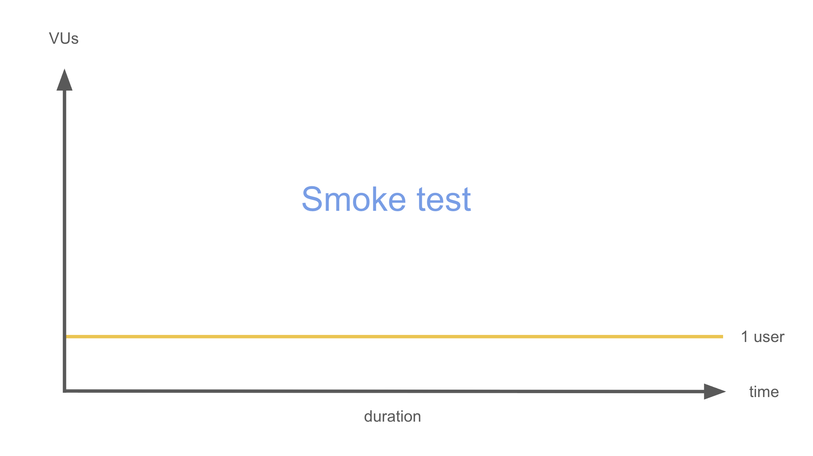

# Smoke test

Table of contents

- [I. Definition](#i-definition)
- [II. Scheme](#ii-scheme)
- [III. Key characteristics](#iii-key-characteristics)
- [IV. Practical examples](#iv-practical-examples)
- [V. Users and time](#v-users-and-time)
- [VI. Examples with k6](#vi-examples-with-k6)
  - [a) Simple example](#a-simple-example)
  - [b) Runnable example](#b-runnable-example)

## I. Definition

**Smoke test is a preliminary test** that checks whether the **basic and critical functionalities** of a software build **work correctly**. It is used to verify that the software is stable enough for further, more detailed testing.

> Easy explanation 
>
> Checking if a bridge is safe enough for cars.

The term comes from hardware testing, where engineers powered on a device and checked if smoke came out — if it did, testing stopped immediately.

## II. Scheme



## III. Key characteristics

- Shallow and broad: Focuses on covering major features, not detailed behavior.
- Quick execution: Designed to run quickly to validate build stability.
- Gatekeeper: Acts as a gate before proceeding to deeper testing.
- Automated or manual: Can be automated but is often a simple checklist when manual.
- Frequent execution: Typically run on every new build to catch show-stopper issues early.

## IV. Practical examples

- Is API returning response?
- Does main page loads?
- Can user login?

## V. Users and time

- Number of virtual users:
  
  Smoke testing is not about concurrency or load — typically performed with **1 user** or simulated user session.

- Execution time:

  Smoke tests should be **fast** - ideal duration is a **few minutes** (e.g., 5–15 min max), depending on project complexity, to quickly give feedback on build health.

## VI. Examples with k6

### a) Simple example

```js
import http from 'k6/http';
import { check } from 'k6';

export const options = {
  vus: 1,
  iterations: 5,
};

export default function () {
  const response = http.get('https://api.example.com/health');

  check(response, {
    'status is 200': (res) => res.status === 200,
    'body is not empty': (res) => res.body.length > 0,
  });
}
```

### b) Runnable example

See [runnable example](runnable-example.md).
