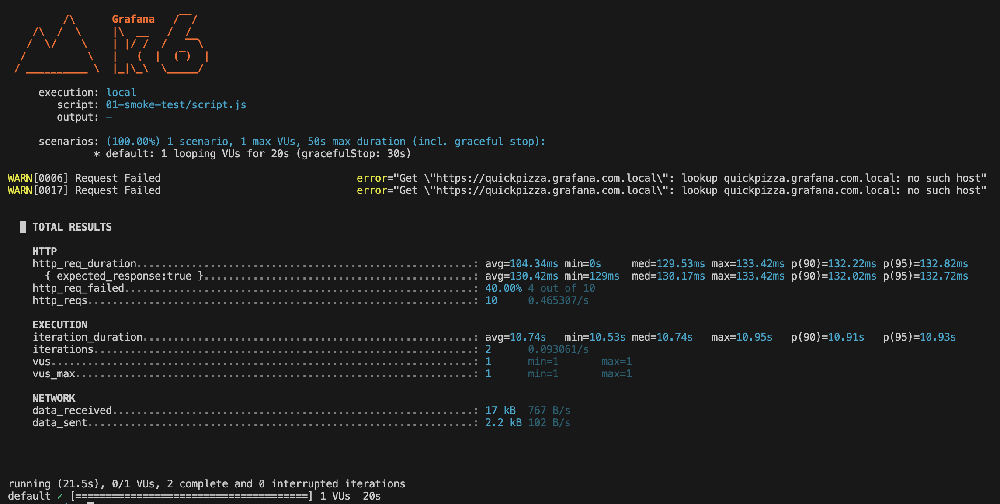

# Runnable example of smoke test

Table of contents

- [Script and how to run](#script-and-how-to-run)
- [Analysis](#analysis)
  - [Test summary](#test-summary)
  - [Observed behavior](#observed-behavior)
  - [Metrics highlights](#metrics-highlights)
  - [Data transferred](#data-transferred)
  - [Overall analysis](#overall-analysis)
  - [Suggestions / takeaways](#suggestions--takeaways)

## Script and how to run

See [script for k6](script.js). To run use:

```bash
k6 run 01-smoke-test/script.js
```

## Analysis

Output from k6:



### Test summary

You ran a k6 script with:

- 1 virtual user (vus: 1)
- Duration: 20 seconds
- Scenario: multiple requests to different URLs with `sleep(1)` after each request.

### Observed behavior

Valid requests:
- https://quickpizza.grafana.com
- https://quickpizza.grafana.com/contacts.php
- https://quickpizza.grafana.com/news.php

Failing requests (DNS resolution failures):
- https://quickpizza.grafana.com.local
  
  k6 warning: `lookup quickpizza.grafana.com.local: no such host.`

Failing requests (404):
- https://quickpizza.grafana.com/example.php
  
  `404` response — k6 counted this as a failed request (because by default k6 treats 4xx/5xx as failed unless handled explicitly in checks).

### Metrics highlights

- `http_req_failed: 40%` → 4 of 10 requests failed:
    - 2 due to DNS resolution errors (`no such host`),
    - 2 due to 404.
- Throughput:
    - `http_reqs: 10` total requests.
    - `0.465 req/s` request rate.
- Response times for successful requests:
    - avg = 104.34 ms
    - p(90) = 132.22 ms
    - p(95) = 132.82 ms
    
    These are all well below the common threshold of 300 ms → good latency.

- Iteration duration: ~10.74 s per iteration (due to `sleep(1)` calls after each request).

### Data transferred

- `17 KB` received
- `2.2 KB` sent
  
  → Consistent with a low-traffic single-user test.

### Overall analysis

- The test worked exactly as coded:
    - k6 correctly logged DNS resolution errors as warnings.
    - 404 responses were counted as `http_req_failed` (this behavior can be customized using `check()` if you want to "accept" 404s).
    - Latency for valid requests was very good (~110 ms on average).
- Your script produced 10 requests in total, across 2 iterations, each iteration lasting ~10.76 s due to deliberate `sleep(1)` pauses.

### Suggestions / takeaways

- If you intend to ignore 404s or treat them as valid responses, wrap requests in `check()` conditions (e.g., `res.status === 404` || `res.status === 200`).
- DNS resolution failures should normally be treated as serious issues unless expected (which they were here for demo purposes).
- Response times look very healthy (~110–145 ms range).
