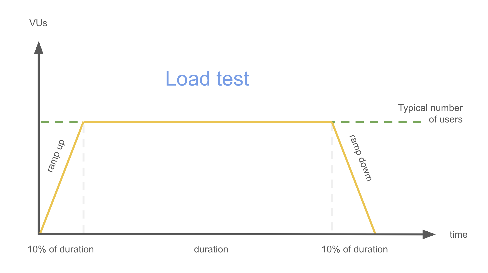

# Load test

Table of contents

- [I. Definition](#i-definition)
- [II. Scheme](#ii-scheme)
- [III. Key characteristics](#iii-key-characteristics)
- [IV. Practical examples](#iv-practical-examples)
- [V. Users and time](#v-users-and-time)
- [VI. Examples with k6](#vi-examples-with-k6)
  - [a) Simple example](#a-simple-example)
  - [b) Runnable example](#b-runnable-example)

## I. Definition

**Load test simulates expected user traffic to measure the performance of a system under normal conditions**. It ensures that the system can handle concurrent users and transactions within acceptable performance thresholds.

> Easy explanation 
>
> Checking if a bridge can safely carry the daily traffic of cars over time.

## II. Scheme



## III. Key characteristics

- Focused on expected load: Simulates real-life usage scenarios with many users.
- Sustained execution: Runs over a longer period to gather performance metrics.
- Concurrent users: Measures how the system handles simultaneous user sessions.
- Performance benchmarks: Helps define acceptable response times, throughput, and error rates.
- Detects bottlenecks: Reveals performance limitations under typical usage.

## IV. Practical examples

- Can 1000 users browse the shop at the same time?
- How fast does the API respond when 500 concurrent users call it?

## V. Users and time

- Number of virtual users:
  
  Depends on the expected traffic. Example: simulate **100–1000 concurrent users**.

- Execution time:

  Usually between **10-60 minutes** (or longer), long enough to measure system behavior under sustained load.

## VI. Examples with k6

### a) Simple example

```js
import http from 'k6/http';
import { check, sleep } from 'k6';

export const options = {
  stages: [
    // approx. 10% of duration, ramp-up to 100 users
    { duration: '3m', target: 100 }, 
    // hold 100 users for 30m
    { duration: '30m', target: 100 },  
    // approx. 10% of duration, ramp-down to 0 users
    { duration: '3m', target: 0 },  
  ],
  thresholds: {
    http_req_failed: ['rate<0.01'],    // <1% errors
    http_req_duration: ['p(95)<1000'], // 95% of requests < 1s
  },
};

export default function () {
  const response = http.get('https://api.example.com/products');

  check(response, {
    'status is 200': (res) => res.status === 200,
  });

  sleep(1);
}
```

### b) Runnable example

See [runnable example](runnable-example.md).