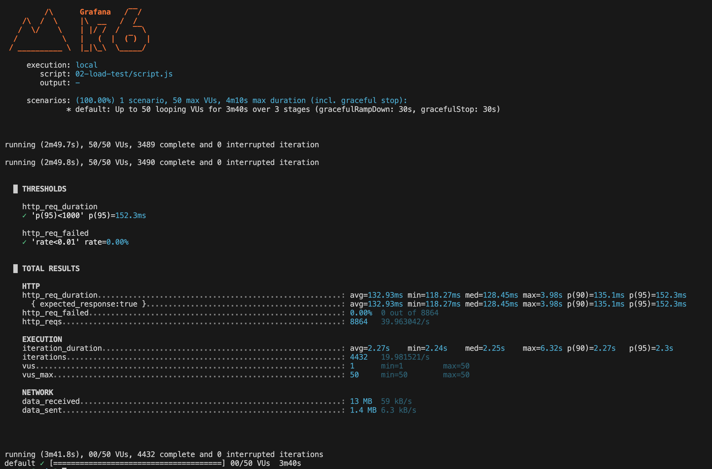

# Load test

Table of contents

- [I. Definition](#i-definition)
- [II. Key characteristics](#ii-key-characteristics)
- [III. Practical examples](#iii-practical-examples)
- [IV. Users and time](#iv-users-and-time)
- [V. Examples with k6](#v-examples-with-k6)
  - [a) Simple example](#a-simple-example)
  - [b) Runnable example](#b-runnable-example)
    - [Analysis](#analysis)
      - [Test summary](#test-summary)
      - [Observed behavior](#observed-behavior)
      - [Metrics highlights](#metrics-highlights)
      - [Data transferred](#data-transferred)
      - [Overall analysis](#overall-analysis)
      - [Suggestions / takeaways](#suggestions--takeaways)

## I. Definition

**Load test simulates expected user traffic to measure the performance of a system under normal conditions**. It ensures that the system can handle concurrent users and transactions within acceptable performance thresholds.

> Easy explanation 
>
> Checking if a bridge can safely carry the daily traffic of cars over time.

## II. Key characteristics

- Focused on expected load: Simulates real-life usage scenarios with many users.
- Sustained execution: Runs over a longer period to gather performance metrics.
- Concurrent users: Measures how the system handles simultaneous user sessions.
- Performance benchmarks: Helps define acceptable response times, throughput, and error rates.
- Detects bottlenecks: Reveals performance limitations under typical usage.

## III. Practical examples

- Can 1000 users browse the shop at the same time?
- How fast does the API respond when 500 concurrent users call it?

## IV. Users and time

- Number of virtual users:
  
  Depends on the expected traffic. Example: simulate **100–1000 concurrent users**.

- Execution time:

  Usually between **10 minutes to 1 hour** (or longer), long enough to measure system behavior under sustained load.

## V. Examples with k6

### a) Simple example

```js
import http from 'k6/http';
import { check, sleep } from 'k6';

export const options = {
  stages: [
    // approx. 10% of duration, ramp-up to 100 users
    { duration: '3m', target: 100 }, 
    // hold 100 users for 30m
    { duration: '30m', target: 100 },  
    // approx. 10% of duration, ramp-down to 0 users
    { duration: '3m', target: 0 },  
  ],
  thresholds: {
    http_req_failed: ['rate<0.01'],    // <1% errors
    http_req_duration: ['p(95)<1000'], // 95% of requests < 1s
  },
};

export default function () {
  const response = http.get('https://api.example.com/products');

  check(response, {
    'status is 200': (res) => res.status === 200,
  });

  sleep(1);
}
```

### b) Runnable example

See script for [load test](script.js).

```bash
k6 run 02-load-test/script.js
```

#### Analysis

Output from k6:



##### Test summary

- Script simulated traffic to https://quickpizza.grafana.com:
  - `contacts.php`
  - `news.php`
- Load pattern:
  - Ramp-up: 0 → 50 VUs in 20s
  - Sustained: 50 VUs for 3m
  - Ramp-down: 50 → 0 VUs in 20s
- Total duration: ~3m42s
- 4452 iterations completed, ~20 iterations/sec

##### Observed behavior

- Application responded consistently under load.
- No HTTP request failures observed (`0.00% failure rate`).
- 95% of requests completed within 135.49ms (well below 1s threshold).

##### Metrics highlights

- Response time:
  - Avg: 128.53ms
  - p(90): 132.97ms
  - p(95): 135.49ms
  - Max: 312.49ms
- Request rate:
  - 40 requests/sec overall.
- Iterations:
  - 4452 iterations (avg iteration ~2.26s)

##### Data transferred

- Received: ~13 MB (~59 kB/s)
- Sent: ~1.4 MB (~6.3 kB/s)

##### Overall analysis

Thresholds met:
- p(95)<1000ms: 135.49ms
- HTTP failures <1%: 0%

Performance stable under 50 concurrent users.

##### Suggestions / takeaways

- Good performance baseline: The service is performant under moderate load.
- Next steps:
  - Test higher loads (e.g., 100+ VUs) for scalability limits.
  - Add checks/assertions to validate content correctness.
  - Monitor backend resource utilization (CPU, memory) alongside k6 metrics.