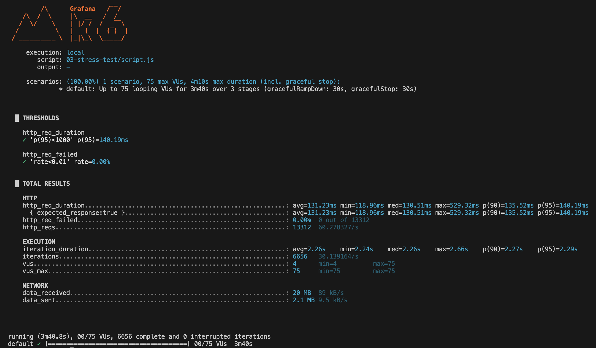

# Stress test

Table of contents

- [I. Definition](#i-definition)
- [II. Key characteristics](#ii-key-characteristics)
- [III. Practical examples](#iii-practical-examples)
- [IV. Users and time](#iv-users-and-time)
- [V. Examples with k6](#v-examples-with-k6)
  - [a) Simple example](#a-simple-example)
  - [b) Runnable example](#b-runnable-example)
    - [Analysis](#analysis)
      - [Test summary](#test-summary)
      - [Observed behavior](#observed-behavior)
      - [Metrics highlights](#metrics-highlights)
      - [Data transferred](#data-transferred)
      - [Overall analysis](#overall-analysis)
      - [Suggestions / takeaways](#suggestions--takeaways)

## I. Definition

TODO

> Easy explanation 
>
> TODO

## II. Key characteristics

TODO

## III. Practical examples

TODO

## IV. Users and time

- Number of virtual users:
  
  TODO

- Execution time:

  TODO

## V. Examples with k6

### a) Simple example

```js
TODO
```

### b) Runnable example

See script for [stress test](script.js).

```bash
k6 run 03-stress-test/script.js
```

#### Analysis

Output from k6:



##### Test summary

TODO

##### Observed behavior

TODO

##### Metrics highlights

TODO

##### Data transferred

TODO

##### Overall analysis

TODO

##### Suggestions / takeaways

TODO