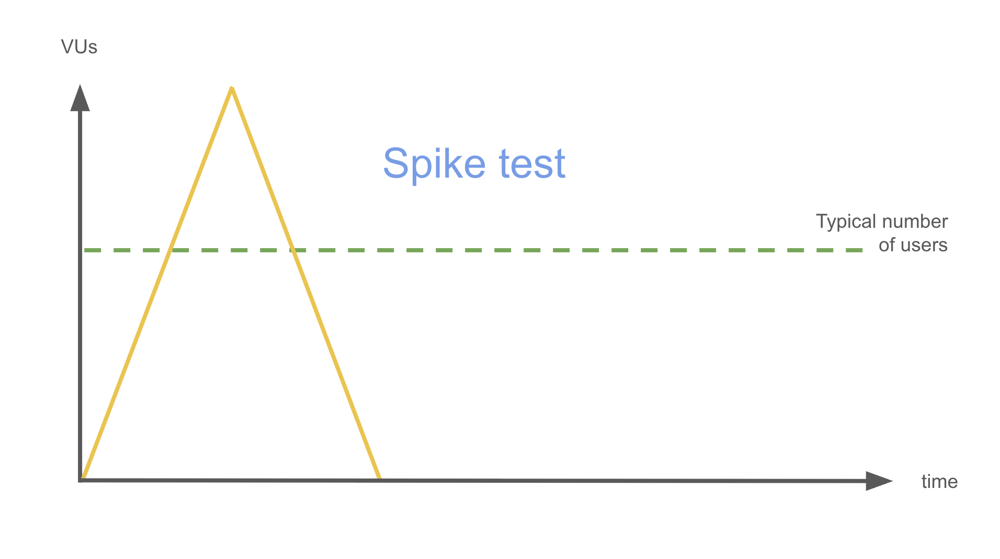

# Spike test

Table of contents

- [I. Definition](#i-definition)
- [II. Scheme](#ii-scheme)
- [III. Key characteristics](#iii-key-characteristics)
- [IV. Practical examples](#iv-practical-examples)
- [V. Users and time](#v-users-and-time)
- [VI. Examples with k6](#vi-examples-with-k6)
  - [a) Simple example](#a-simple-example)
  - [b) Runnable example](#b-runnable-example)

## I. Definition

**Spike test evaluates system behavior under a sudden, sharp increase in load followed by an immediate decrease.** The goal is to measure resilience and recovery after an abrupt surge in traffic.

> Easy explanation 
>
> Checking how a bridge reacts when an unexpected rush of cars crosses it at once.

## II. Scheme



## III. Key characteristics

- Sudden sharp load increase: Quickly ramps up users far beyond normal load.
- Short duration: Spike lasts only briefly.
- Recovery focus: Observes how quickly and gracefully the system recovers after the spike.
- Resilience check: Ensures no lingering effects on performance or stability.

## IV. Practical examples

- How does the system handle an instant increase from 100 to 1000 users?
- Does performance degrade temporarily or permanently after the spike?

## V. Users and time

- Number of virtual users:
  
  Simulates **rapid jump to 2–3x of the load**. Example: If load is 500 users — spike test with 1000–1500 users.

- Execution time:

  Short test — typically **5 to 15 minutes**, spike itself lasting **1–2 minutes**.

## VI. Examples with k6

### a) Simple example

```js
import http from 'k6/http';
import { check, sleep } from 'k6';

export const options = {
  stages: [
    { duration: '30s', target: 0 },     // idle
    { duration: '30s', target: 1000 },  // sudden spike to 1000 users
    { duration: '1m', target: 1000 },   // hold for 1 minute
    { duration: '30s', target: 0 },     // drop to 0 users
  ],
  thresholds: {
    http_req_failed: ['rate<0.01'],    // <1% errors
    http_req_duration: ['p(95)<1000'], // 95% requests < 1s
  },
};

export default function () {
  const response = http.get('https://api.example.com/products');

  check(response, {
    'status is 200': (res) => res.status === 200,
  });

  sleep(1);
}
```

### b) Runnable example

See [runnable example](runnable-example.md).