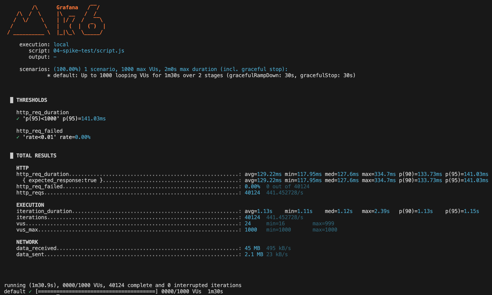

# Runnable example of spike test

Table of contents

- [Script and how to run](#script-and-how-to-run)
- [Analysis](#analysis)
  - [Test summary](#test-summary)
  - [Observed behavior](#observed-behavior)
  - [Metrics highlights](#metrics-highlights)
  - [Data transferred](#data-transferred)
  - [Overall analysis](#overall-analysis)
  - [Suggestions / takeaways](#suggestions--takeaways)

## Script and how to run

See [script for k6](script.js). To run use:

```bash
k6 run 04-spike-test/script.js
```

## Analysis

Output from k6:



### Test summary

- Spike profile:
  - Up to 1000 virtual users (VUs).
  - 2 stages over 1m30s, followed by a 30s graceful ramp-down.
  - Total duration: ~2m (including graceful stops).
- 40,124 iterations completed.

### Observed behavior

- The system handled an abrupt surge to 1000 concurrent VUs without failures.
- No request failures (`http_req_failed=0.00%`).
- Response times remained stable and well below defined thresholds during the spike and recovery.

### Metrics highlights

- Requests: 40,124 total (~441 requests/sec).
- Response time:
  - Average: 129.22ms
  - Median: 127.6ms
  - 95th percentile (p95): 141.03ms (well below 1000ms threshold).
- Iteration duration:
  - Average: 1.13s
  - 95th percentile: 1.15s.

### Data transferred

- Total received: ~45 MB (~495 kB/sec).
- Total sent: ~2.1 MB (~23 kB/sec).

### Overall analysis

The system demonstrated excellent resilience during the spike test, absorbing a sudden and significant traffic surge without performance degradation. Response times remained consistent, and no errors occurred, suggesting good scalability and robust architecture.

### Suggestions / takeaways

- The system is well-prepared to handle short-term traffic spikes.
- Next steps could include stress tests with longer sustained periods or testing simultaneous spikes to confirm consistency under repeated surges.
- Backend monitoring during spikes could provide additional insight into capacity limits and areas for optimization.