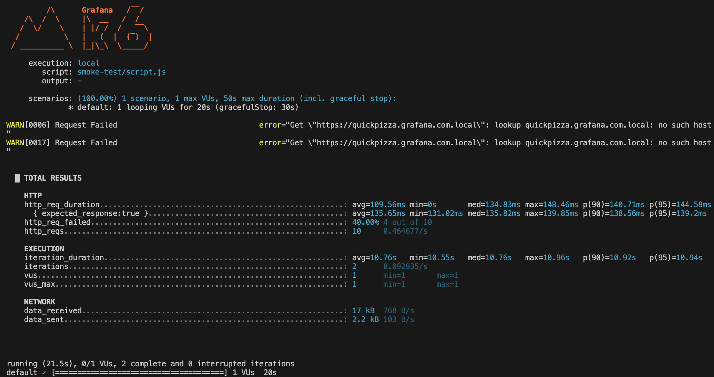

# Smoke test

Table of contents

- [I. Definition](#i-definition)
- [II. Key characteristics](#ii-key-characteristics)
- [III. Practical examples](#iii-practical-examples)
- [IV. Users and time](#iv-users-and-time)
- [V. Examples with k6](#v-examples-with-k6)
  - [a) Simple example](#a-simple-example)
  - [b) Runnable example](#b-runnable-example)
    - [Analysis](#analysis)
      - [Test summary](#test-summary)
      - [Observed behavior](#observed-behavior)
      - [Metrics highlights](#metrics-highlights)
      - [Data transferred](#data-transferred)
      - [Overall analysis](#overall-analysis)
      - [Suggestions / takeaways](#suggestions--takeaways)

## I. Definition

**Smoke test is a preliminary test** that checks whether the **basic and critical functionalities** of a software build **work correctly**. It is used to verify that the software is stable enough for further, more detailed testing.

> Easy explanation 
>
> Checking if a bridge is safe enough for cars and trucks.

The term comes from hardware testing, where engineers powered on a device and checked if smoke came out — if it did, testing stopped immediately.

## II. Key characteristics

- Shallow and broad: Focuses on covering major features, not detailed behavior.
- Quick execution: Designed to run quickly to validate build stability.
- Gatekeeper: Acts as a gate before proceeding to deeper testing.
- Automated or manual: Can be automated but is often a simple checklist when manual.
- Frequent execution: Typically run on every new build to catch show-stopper issues early.

## III. Practical examples

- Is API returning response?
- Does main page loads?
- Can user login?

## IV. Users and time

- Number of virtual users:
  
  Smoke testing is not about concurrency or load — typically performed with **1 user** or simulated user session.

- Execution time:

  Smoke tests should be **fast** - ideal duration is a **few minutes** (e.g., 5–15 min max), depending on project complexity, to quickly give feedback on build health.

## V. Examples with k6

### a) Simple example

```js
import http from 'k6/http';
import { check } from 'k6';

export const options = {
  vus: 1,
  iterations: 5,
};

export default function () {
  const response = http.get('https://api.example.com/health');

  check(response, {
    'status is 200': (res) => res.status === 200,
    'body is not empty': (res) => res.body.length > 0,
  });
}
```

### b) Runnable example

See script for [smoke test](script.js).

```bash
k6 run smoke-test/script.js
```

#### Analysis

Output from k6:



##### Test summary

You ran a k6 script with:

- 1 virtual user (vus: 1)
- Duration: 20 seconds
- Scenario: multiple requests to different URLs with `sleep(1)` after each request.

##### Observed behavior

Valid requests:
- https://quickpizza.grafana.com
- https://quickpizza.grafana.com/contacts.php
- https://quickpizza.grafana.com/news.php

Failing requests (DNS resolution failures):
- https://quickpizza.grafana.com.local
  
  k6 warning: `lookup quickpizza.grafana.com.local: no such host.`

Failing requests (404):
- https://quickpizza.grafana.com/example.php
  
  `404` response — k6 counted this as a failed request (because by default k6 treats 4xx/5xx as failed unless handled explicitly in checks).

##### Metrics highlights

- `http_req_failed: 40%` → 4 of 10 requests failed:
    - 2 due to DNS resolution errors (`no such host`),
    - 2 due to 404 (not found).
- Throughput:
    - `http_reqs: 10` total requests.
    - `0.464 req/s` request rate.
- Response times for successful requests:
    - avg = 109.56 ms
    - p(90) = 140.71 ms
    - p(95) = 144.58 ms
    
    These are all well below the common threshold of 300 ms → good latency.

- Iteration duration: ~10.76 s per iteration (due to `sleep(1)` calls after each request).

##### Data transferred

- `17 KB` received
- `2,2 KB` sent
  
  → Consistent with a low-traffic single-user test.

##### Overall analysis

- The test worked exactly as coded:
    - k6 correctly logged DNS resolution errors as warnings.
    - 404 responses were counted as `http_req_failed` (this behavior can be customized using `check()` if you want to "accept" 404s).
    - Latency for valid requests was very good (~110 ms on average).
- Your script produced 10 requests in total, across 2 iterations, each iteration lasting ~10.76 s due to deliberate `sleep(1)` pauses.

##### Suggestions / takeaways

- If you intend to ignore 404s or treat them as valid responses, wrap requests in `check()` conditions (e.g., `res.status === 404` || `res.status === 200`).
- DNS resolution failures should normally be treated as serious issues unless expected (which they were here for demo purposes).
- Response times look very healthy (~110–145 ms range).
